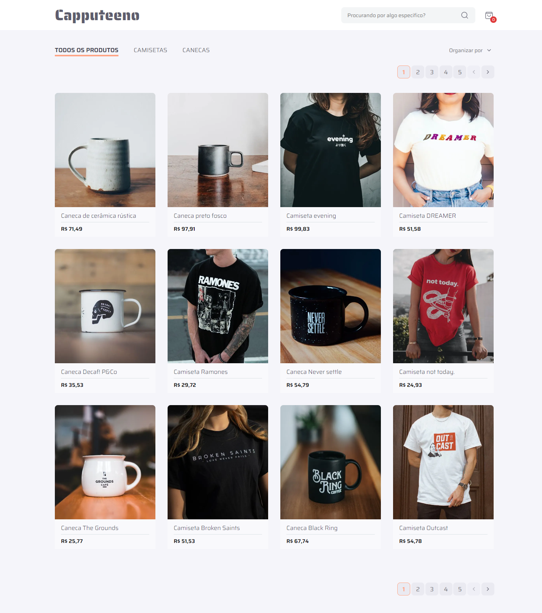

# E-commerce Challenge - Capputeeno

Hello there! This repository holds my solution to the Frontend Challenge provided by Rocket Seat. I'm excited to share my approach and the features I implemented. If you have any questions or feedback, feel free to reach out to me.

## Project Overview

For this challenge, the goal was to create an e-commerce platform for selling mugs and T-shirts. Here's a quick rundown of the key features I implemented:

- **Product Catalog:** Implemented a paginated catalog of products.
- **Product Filtering:** Users can filter products by category for a streamlined shopping experience.
- **Search Functionality:** Enabled users to search for products by name.
- **Shopping Cart:** Users can easily add or remove products from their shopping cart.
- **Checkout:** Implemented a seamless checkout process for users to complete their purchase.

## Technologies Used

I utilized the following technologies to bring this project to life:

- **Next.js:** Leveraged the power of Next.js for a fast and efficient web application.
- **Typescript:** Ensured type safety and improved code maintainability with TypeScript.
- **React.js:** Built the user interface using React.js for its component-based architecture.
- **Sass:** Styled the components with SASS for a maintainable and modular styling approach.
- **Figma:** Followed the provided Figma prototype for a pixel-perfect design.

## Getting Started

To explore the project locally, follow these steps:

1. Clone this repository.
2. Navigate to the project directory.
3. Install dependencies using `npm install`.
4. Run the application with `npm run dev`.

## Live Demo

Check out the live demo of the project [here](https://capputeeno-challenge-rgomes98.vercel.app/).

## My Development Process

Throughout the development process, I encountered some interesting challenges and made key decisions. Here are a few highlights:

- **Context API:** Utilized the Context API to manage global state related to the user's shopping cart. This allowed for seamless communication between components without the need for prop drilling, improving the overall maintainability of the application.
- **Custom Hooks:** Created custom hooks to encapsulate and reuse logic across components, promoting a cleaner and more maintainable codebase. For example, I implemented a custom hook for managing the shopping cart state.
- **State Management:** Implemented effective state management for a smooth user experience.
- **Responsive Design:** Ensured the application looks great on various device screen sizes.

## Evaluation Criteria

During the evaluation, I focused on the following criteria:

- **State Management:** Demonstrated proficiency in managing application state.
- **Componentization:** Ensured a modular and reusable component structure.
- **Responsiveness:** Prioritized a responsive design for a consistent user experience.
- **Usability:** Paid attention to user interactions and overall usability.
- **Accessibility:** Ensured the application is accessible to users with diverse needs.
- **Code Standards:** Followed coding standards for clean and maintainable code.
- **Commit Conventions:** Adhered to conventional commit message standards.

## Additional Considerations

Here are some additional considerations that enhance the project:

- **Deployment:** Deployed the project on [Vercel](https://vercel.com/) for easy accessibility.
- **Next.js Cache:** Leveraged Next.js caching for improved performance.

---

_This challenge was a fantastic opportunity to showcase my skills, and I thoroughly enjoyed working on it. Feel free to explore the live demo and the codebase. Looking forward to your feedback!_
